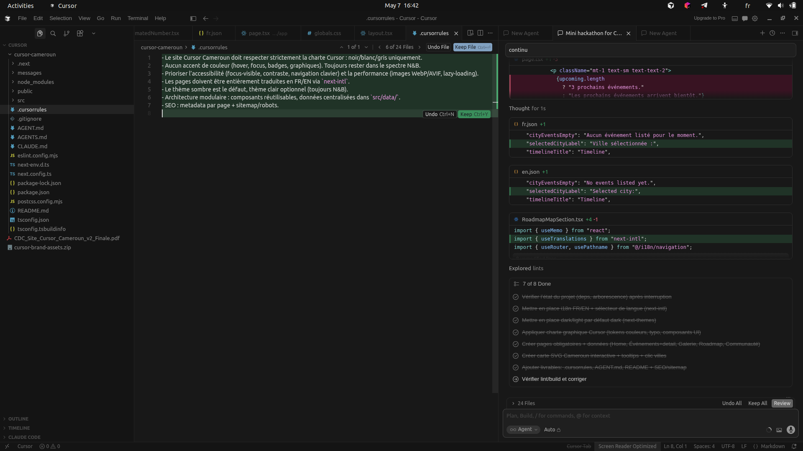
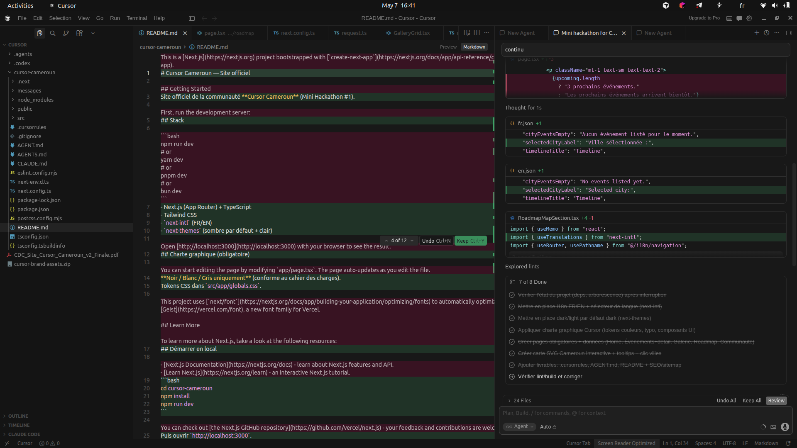
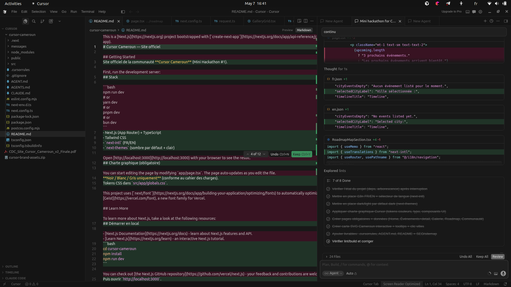

# Cursor Cameroun — Site officiel

Site officiel de la communauté **Cursor Cameroun** (Mini Hackathon #1).

## Stack

- Next.js (App Router) + TypeScript
- Tailwind CSS
- `next-intl` (FR/EN)
- Theme provider custom (sombre par défaut + clair)

## Charte graphique (obligatoire)

**Noir / Blanc / Gris uniquement** (conforme au cahier des charges).  
Tokens CSS dans `src/app/globals.css`.

## Configuration et Variables d'Environnement

Le projet utilise des variables d'environnement pour l'authentification et l'envoi d'emails. Avant de lancer le projet, vous devez configurer votre environnement :

1. Copiez le fichier d'exemple :
```bash
cp .env.example .env
```
2. Ouvrez le fichier `.env` et complétez les valeurs (mot de passe admin, clé API Resend, etc.).

## Démarrer en local

```bash
cd cursor-cameroun
npm install
npm run dev
```

Puis ouvrir `http://localhost:3000`.

## Données et Assets
- [x] Liens officiels (WhatsApp / GitHub org / LinkedIn) intégrés dans `src/data/links.ts`
- [x] Événements et pages détails complétés dans `src/data/events.ts` et `src/data/events.json`
- [x] États d'événements supportés : `upcoming`, `ongoing`, `past`
- [x] Dates d'événements : `startDateISO` + `endDateISO` (compatibilité `dateISO` conservée)
- [x] Galerie avec filtre événement/date + lightbox + lazy-loading
- [x] Logos officiels Cursor ajoutés dans `public/brand/`

## Livrables hackathon

- `.cursorrules` : règles projet Cursor
- `AGENT.md` : usage de Cursor pendant le hackathon
- SEO : `src/app/sitemap.ts` + `src/app/robots.ts`

## État de conformité CDC (v2.0)

- [x] Pages obligatoires : Home, Events, Gallery, Roadmap, Community
- [x] Navigation responsive avec CTA rejoindre, langue, thème
- [x] i18n FR/EN via `next-intl` (messages centralisés)
- [x] Thème sombre par défaut, thème clair disponible
- [x] Sitemap + robots
- [x] Metadata de page ajoutées sur les pages principales
- [~] Performance images : lazy-loading en place, migration WebP/AVIF à finaliser sur certaines sources
- [~] Carte Cameroun interactive présente; enrichissement "10 régions" restant possible

## Galerie & Aperçus de Travail

Voici quelques captures d'écran illustrant notre travail collaboratif avec Cursor :

### Édition du AGENT.md


### Mise à jour du README


### Session de Travail


## Commandes utiles

```bash
npm run dev
npm run lint
```
